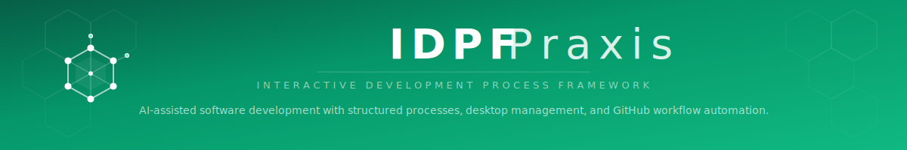

  

> **This is the distribution repository.** It contains the released framework files that users install via Praxis Hub Manager.

A structured framework for building software with an AI assistant. You define what to build; the AI writes the code. IDPF provides the process — TDD enforcement, story-driven workflows, review checkpoints, and release management — so the AI builds your project methodically. No coding experience required.

---

## Prerequisites

| Requirement | Purpose |
|-------------|---------|
| [Node.js](https://nodejs.org/) >= 18 | Runtime for framework scripts and utilities |
| [Git](https://git-scm.com/) | Version control and branch-based workflows |
| [GitHub CLI (`gh`)](https://cli.github.com/) | Issue management and PR workflows |
| [gh-pmu](https://github.com/rubrical-works/gh-pmu) | GitHub project board integration (`gh extension install rubrical-works/gh-pmu`) |
| [Claude Code](https://claude.ai/code) | AI assistant that executes the framework |
| [Praxis Hub Manager](https://github.com/rubrical-works/px-manager) | Desktop app for hub and project management |

> **Gemini CLI support** is currently in development as an extension package.

---

## Installation

Install and manage IDPF through **Praxis Hub Manager**, the cross-platform desktop application:

1. **Create a hub** — Praxis Hub Manager downloads the framework and sets up the central hub
2. **Add projects** — Use the project wizard to create new projects or link existing ones

Praxis Hub Manager handles:
- Creating a central hub that serves multiple projects
- Deploying framework files, commands, rules, and scripts
- Configuring Claude Code integration via symlinks/junctions
- Preserving your command customizations during hub updates

### Adding IDPF to Existing Projects

To add IDPF to a project that already has code, open **Praxis Hub Manager** and click **Add Existing**. Browse to your repository root and the wizard will detect your project structure. On confirmation, it will:

- Create the `.claude/` directory structure with symlinks to your hub
- Copy extensible commands that you can customize (preserving any existing extension blocks)
- Generate a `framework-config.json` tailored to your project (merging existing skills if present)
- Preserve any existing `.claude/` configuration

---

## Frameworks

| Framework | Use When |
|-----------|----------|
| **IDPF-Agile** | Story-based development with TDD |
| **IDPF-Vibe** *(coming soon)* | Exploration phase, unclear requirements → evolves to Agile |

## Documentation

The `Docs/` directory contains guides and references for users at all levels:

| Section | Contents |
|---------|----------|
| `Docs/01-Getting-Started/` | Quick start, your role, workflow guide, planning approaches, troubleshooting |
| `Docs/02-Advanced/` | Concurrent sessions, workstreams, customizing commands, epic reviews, hub architecture, skill guides |
| `Docs/03-Philosophy/` | Context engineering, intentional friction, requirements over execution, Agile vs Vibe |
| `Docs/04-Suitability/` | Suitability assessments for solo developers, full-stack apps, microservices, N-tier |
| `Docs/Commands/` | Reference documentation for all slash commands |
| `Docs/Roadmap.md` | Framework development roadmap |

Additional framework references:
- `Overview/Framework-Overview.md` — Complete ecosystem reference
- `Reference/Session-Startup-Instructions.md` — Startup procedure

### Domains (11)

Domains are specialized knowledge lenses that activate during reviews (charter, proposal, PRD, issue, and code review). Activate with `--with security,performance` or configure in your project charter.

| Domain | Focus |
|--------|-------|
| QA-Automation | UI and E2E test automation |
| Performance | Load, stress, and capacity testing |
| Security | OWASP-based security testing |
| Accessibility | WCAG-based accessibility testing |
| Chaos | Resilience and failure-mode testing |
| Contract-Testing | Consumer/provider contract testing |
| API-Design | REST/GraphQL API design conventions |
| Observability | Logging, tracing, metrics, alerting |
| i18n | Internationalization and localization |
| SEO | Technical SEO and structured data |
| Privacy | Consent, cookies, GDPR/CCPA compliance |

### Requirements

Requirements are managed through Product Requirements Documents (PRDs). Use the `/create-prd` command to transform a proposal into a structured PRD with acceptance criteria, then `/create-backlog` to generate epics and stories from it.

---

## Skills

Skills have been migrated to the [idpf-praxis-skills](https://github.com/rubrical-works/idpf-praxis-skills) repository. Use the `/fw-import-skills` command to import skills into a framework development environment, or install skills to user projects via Praxis Hub Manager.

---

## Domain Specialists (25)

| Specialist | Specialist | Specialist |
|------------|------------|------------|
| Accessibility-Specialist | API-Integration-Specialist | Backend-Specialist |
| Cloud-Solutions-Architect | Database-Engineer | Data-Engineer |
| Desktop-Application-Developer | DevOps-Engineer | Embedded-Systems-Engineer |
| Frontend-Specialist | Full-Stack-Developer | Game-Developer |
| Graphics-Engineer-Specialist | ML-Engineer | Mobile-Specialist |
| Performance-Engineer | Platform-Engineer | QA-Test-Engineer |
| Security-Engineer | SRE-Specialist | Systems-Programmer-Specialist |
| Technical-Writer-Specialist | | |

---

## Updating

Open **Praxis Hub Manager** and use the hub update feature to download and apply the latest framework version.

---

## About the Framework Files

The framework files in this repository (rules, commands, system instructions, and references) have been **minimized** for token efficiency. This means formatting, comments, verbose explanations, and whitespace have been stripped — while all functional content is preserved.

**Why?** Claude Code loads these files into its context window at startup and during work. Context windows have a finite token budget, and every token spent on formatting or commentary is a token unavailable for your code and conversation. Minimization reduces framework overhead by ~47%, leaving more room for what matters.

**What this means for you:**
- The `.md` files in `Overview/`, `Reference/`, `IDPF-Agile/`, etc. will look terse if you read them on GitHub — this is intentional
- For human-readable documentation, see the `Docs/` directory which contains full guides and references
- The framework works identically whether minimized or not — only the presentation changes

---

## Contributing

See [CONTRIBUTING.md](CONTRIBUTING.md) for how to report bugs, request features, and get involved.

---

## License

Copyright 2025-2026 Rubrical Works

Licensed under the Apache License, Version 2.0. See [LICENSE](LICENSE) for the full text.
